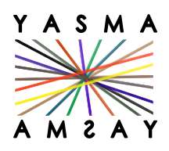

<p align="center"></p>

## YASMA - *<ins>Y</ins>et <ins>a</ins>nother <ins>sm</ins>all RNA <ins>a</ins>nnotator*
 
**warning**: this project is in active development and the readme may be out of date. 

### What is yasma?
This pipeline adds to a wide field of tools which have been used to assess ***small-RNA-sequencing*** data. Yasma is a **genome-based *de novo* approach** which is focused on **the whole sRNA population**, not just a few classes like miRNAs.

There are other approaches that follow a similar strategy, namely [ShortStack](https://github.com/MikeAxtell/ShortStack). Yasma tries to solve some persistent issues with these approaches, which appear to be exacerbated in challenging systems, such as sRNAs in Fungi.

### Is this published?
There is a manuscript in preparation detailing the value of the approache presented here. This will be updated with a bioRxiv when submitted to a journal *(hopefully very soon)*.

### Problems with current approaches
* **Over-merging** of distinct, but closely oriented loci.
* **Creeping annotations** which don't don't represent the shape of a expressed region.
* **Under-merging** where numerous similar loci are annotated separately due to sequencing gaps.
* **Sensitivity to the depth** of a sRNA library relative to it's assembly size. *This seems to be particularly problematic in fungi*.


### General annotation strategy

Yasma relies on sRNA alignments to form genomic annotations. Alignments are performed using ShortStack3/4's alignment protocol (based on bowtie1), which is well supported by [Johnson et al 2016](https://doi.org/10.1534/g3.116.030452).


Annotation based on these alignments follows a multi step approach:
1. Building a ***sRNA coverage profile***.
2. Calculating the RPM threshold which best balances annotating the most reads in the smallest genomic space.
3. Building a profile of genomic-regions which are sufficiently deep based on this threshold.
4. Merging of peaks which have ***similar sRNA profiles***.

This results in contiguous loci which are more homogenous in profile. It also tends to avoid over-annotation of background sequences.

# Installation

Yasma is written in `python 3.x`. It is not yet in any package managers, but it is fairly easy to install directly with github. This should work in linux/unix systems, though I'm sure bugs will crop up (make a issue request please!!).

### Installing with `git`
```
## cloning the repo with git
git clone https://github.com/NateyJay/YASMA.git

## moving it somewhere permanent.
mv ./YASMA /usr/local/

## adding this to $PATH - you will want to add the following line to your ~/.bash_rc (linux) or ~/.bash_profile (mac). You can open it using: nano ~/.bash_profile
## export PATH="/usr/local/YASMA:$PATH"

## sourcing the new ~/.bash_profile file
source ~/.bash_profile
```

### Installing with github desktop
This is a useful tool for managing github repos you use. Great for those that like command-line and github, but find the `git` and `gh` cli tools cumbersome. 

With this, you can download repo directly from `NateyJay/YASMA`. You will also need to add the folder to your path, but probably don't want to move it.


### Installing with `curl`
If you don't want to use git for some reason, you can download the latest release with curl. This may have a different directory name so you need to adjust accordingly.

```
curl -L -O https://github.com/NateyJay/YASMA/archive/refs/tags/v0.1.0-beta.zip
unzip v0.1.0-beta

## move and add to path as above.
```

### Dependencies
Yasma makes use of many tools through wrappers, as well as several non-standard python modules. Most of these should be easy enough to install.

#### Python modules:

[`click`](https://click.palletsprojects.com/) is required, as it manages the cli interface for the tool

```
python3 -m pip install click
python3 -m pip install click-option-group
```

```
[`pysam`]([https://github.com/deeptools/pyBigWig](https://pypi.org/project/pysam/)) allows samtools stand-alone in python.
python3 -m pip install pysam
```

[`pyBigWig`](https://github.com/deeptools/pyBigWig) allows python-native functions with bigwig files.
```
python3 -m pip install pyBigWig

# or 

conda install pybigwig -c conda-forge -c bioconda
```

#### System modules:
Most of these are required for basic functions - each module will inform you if you are missing something. Yasma expects each of these executable from the PATH.

* ~~[`samtools`](https://www.htslib.org/)~~ this is now managed with pysam
* align -> [`bowtie` (1)](https://bowtie-bio.sourceforge.net/index.shtml)
* ~~[`ShortStack` (3 or 4)](https://github.com/MikeAxtell/ShortStack)~~ this is now only required for running ShortStack through yasma.
* hairpin -> `rnafold` from the [ViennaRNA](https://www.tbi.univie.ac.at/RNA/) package.
* trim -> [`cutadapt`](https://cutadapt.readthedocs.io/en/stable/)


# Yasma Modules

Yasma is organized into several modules, made with the CLI-module [click](https://click.palletsprojects.com/). These modules are organized into several major sections which are generally ordered by processing step:

```
Commands:

  Preliminary:
    inputs                    A tool to log inputs, which will be...

  Processing:
    adapter                   Tool to check untrimmed-libraries for 3'...
    download                  Tool to check untrimmed-libraries for 3'...
    trim                      Wrapper for trimming using cutadapt.
    align                     Aligner based on shortstack3
    shortstack-align          Wrapper for alignment using ShortStack/bowtie.

  Utilites:
    merge                     Tool for merging multiple alignments with...

  Annotation:
    tradeoff                  Annotator using large coverage window and...

  Calculation:
    context                   Compares annotations to identify cluster...
    count                     Gets counts for all readgroups, loci, strand,...
    hairpin                   Evaluates annotated loci for hairpin or miRNA...
    jbrowse                   Tool to build coverage and config files for...
    coverage                  Produces bigwig coverage files for use in...

  Utilities:
    subsample                 Utility to subsample libraries to a specific...
    cram-to-bam               Changes crams to bam alignments.
    normalize-alignment-name  Fixes old alignment file names.
    size-profile              Convenience function for calculating aligned...
    readgroups                Convenience function to list readgroups in an...

  Ann. wrappers:
    shortstack3               Wrapper for annotation using ShortStack3.
    shortstack4               Wrapper for annotation using ShortStack4.
```


### Directory oriented analysis

To help with ease of use, Yasma orients all of its analyses around a directory. Files produced and referenced by yasma are all stored in the `config.json` file, using relative paths. Analyses that produce outputs will automatically update this file, meaning you need not manually transmit information from one module to the next (for example: finding an adapter sequence, then trimming the libraries with it). 

`inputs.json` is human-readable and can be pretty easily modified manually, though not normally advisable.

All modules will automatically produce `config.json` if it is not found, and use lazy evaluation looking for included values. This makes it easy to jump in at a later step if you have done prior analyses separately.


Modules can be run simply with `yasma.py [module] -o output_directory_path [...]`. The only required option for all modules is `-o, --output_directory`, and yasma will automatically tell you if you are missing any other inputs.


### Preliminary step - *inputs*

Inputs is not a required step, but it can be a major time-saver. Basically, it produces a file `config.json` which can store all input files for your analysis. If you specify these files here, you need not call them in subsequent steps. 

This also lets you know if there are incongruities in your data. For example, it compares chromosome names found in your reference genome to a gene annotation, showing if they don't match. This can frequently be a real time-saver as it catches common errors.


### Processing

Using these modules, yasma can look for adapter sequences, trim libraries (using cutadapt), and align them to a genome (using shortstack3/4 x bowtie1).

All of these could be run manually, but alignment with shortstack is essential as the annotation looks for readgroup information in shortstack's bam format.


### Annotation

The main annotation module is called `tradeoff`, due to its threshold finding with a read vs genome tradeoff. This analysis should work on any shortstack bam/cram alignment. 

There are several options, but an essential one specified here is `-r, --annotation_readgroups`. This allows you to make your annotation based on a smaller group of libraries from your whole alignment. This is really useful when working with a large analysis with multiple replicate-groups, and you might only want to annotate sRNAS in one of them (e.g. wt replicates among many mutants).

Many outputs are produced from this step, with some described here:

* `loci.gff3` and `loci.txt` - the core annotation output, identifying loci and their dimensions (in gff and tabular formats). 
* `coverage.bw` and `kernel.bw` - track files associated with the sRNA alignment coverage and padded_coverage by max() (kernel).
* `regions.gff3` and `revised_regions.gff3` - annotation files of distinct sRNA regions based off the padded_coverage, and the revision of those regions including nearby similar sRNAs.
* `thresholds.txt` - a table showing the percent of the genome retrieved and reads annotated for each threshold in sRNA abundance.
* `reads.txt` - a breakdown of the aligned reads making up the top 30% of a locus's total expression. This is useful to quickly get constituent sequences in complex loci.


### Calculation

These are secondary calculations that will be done on a tradeoff annotation.

`yasma.py count` 
This produces a file of counts for every locus. This is broken out into a separate module because yasma does this very thoroughly, producing a simple count matrix (useful for DEseq) and also a large, long format count with separates counts by locus, strand, size, and readgroup. This can save some headaches in later analyses.

`yasma.py context`
Compares loci locations with an NCBI-formatted `.gff3` file provided. Gives overlaps and nearby genes for each sRNA locus.

`yasma.py jbrowse`
This module was made to take some of the headache out of making nicely-formatted jbrowse-ready coverage and annotation maps. This produces `.bw` files for all specified sizes and strands of sRNAs, which can then be plotted in the same track with provided configuration code. If provided with a `-j, --jbrowse_directory`, this will automatically look for a config file, update it, and copy all relevant files to a directory based on the genome name.

`yasma.py hairpin` 
This tool is still in development, but it is meant to evaluate all loci for the possibility that they are derived from an RNA hairpin, rather than RDR-dsRNA. This is not finalized, but it generally looks for stranded regions and folds them, analyzing their profile based on a battery of rules from multiple publications.


### Ann. wrappers

We love [shortstack](https://github.com/MikeAxtell/ShortStack) here. Consdering it is essential for the alignment of our data, we also include wrappers for ShortStack annotation built into the directory organization of this tool. Useful for easily comparing annotations. Requires that `ShortStack3` or `ShortStack4` are executable from command line (these is not their normal names: "ShortStack").

### Other stuff

`utilities` includes several other functions, most of which have been used primarily for testing. Probably not relevant as of now to wider use.


## YASMA cookbook
```
## Using the following hypothetical libraries from the corresponding conditions
# lib_1.fa -> hyphae
# lib_2.fa -> hyphae
# lib_3.fa -> conidia
# lib_4.fa -> conidia
# lib_5.fa -> conidia

## supplying all input information for the analysis
yasma.py inputs -o full_analysis \
-ul lib_1.fa lib_2.fa lib_3.fa lib_4.fa lib_5.fa \
-g path_to_your_genome.fa \
-c lib_1:hyphae lib_2:hyphae lib_3:conidia lib_4:conidia lib_5:conidia

## basic call
yasma.py adapter -o .
yasma.py trim -o .
yasma.py align -o .
yasma.py tradeoff -o . ## this will annotate with all conditions
yasma.py count -o .


## to perform the annotation with a specific condition(s)
yasma.py tradeoff -o . -ac hyphae


## using pre-trimmed libraries
yasma.py inputs -o full_analysis \
-tl lib_1.fa lib_2.fa lib_3.fa lib_4.fa lib_5.fa \
-g path_to_your_genome.fa \
-c lib_1:hyphae lib_2:hyphae lib_3:conidia lib_4:conidia lib_5:conidia

yasma.py align -o .
yasma.py tradeoff -o .
yasma.py count -o .


## using an alignment as input (note, this must contain the @RG flag to indicate source libraries.
yasma.py inputs -o full_analysis \
-a path_to_alignment.bam \ 
-c lib_1:hyphae lib_2:hyphae lib_3:conidia lib_4:conidia lib_5:conidia

yasma.py tradeoff -o .
yasma.py count -o .
```


