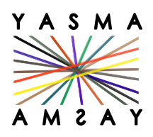

<p align="center"></p>

### What is yasma?
This pipeline adds to a wide field of tools which have been used to assess ***small-RNA-sequencing*** data. Yasma is a **genome-based *de novo* approach** which is focused on **the whole sRNA population**, not just a few classes like miRNAs.

**YASMA-tradeoff** is the annotator tool, while other modules are just helper functions and wrappers for consistent analysis of sRNAs.

There are other approaches that follow a similar strategy, namely [ShortStack](https://github.com/MikeAxtell/ShortStack). Yasma was born out of solving some persistent issues with ShortStack3, which appear to be exacerbated in challenging systems, such as sRNAs in Fungi (ShortStack4 has resolved some of these).

### Is this published?
This work is currently in submission, with a completed manuscript available on [bioRxiv](https://www.biorxiv.org/content/10.1101/2025.01.25.634868v1).

### Problems with current approaches
* **Creeping annotations** which don't don't represent the shape of a expressed region, sometimes leading to very large loci.
* **Under-merging** where numerous similar loci are annotated separately due to sequencing gaps.
* **Weak identifications** of sRNA locus classes in non-canonically sized loci and organisms where we know relatively little (fungi, for example).


## *YASMA-tradeoff* - balancing sensitivity and specificity
This is the small RNA annotation tool for this suite. This is where the magic happens.

Annotation based on these alignments follows a multi step approach:
1. Building an average ***sRNA coverage profile*** from replicate libraries.
2. Calculating the RPM threshold which best balances annotating the most reads in the smallest genomic space.
3. Building a profile of genomic-regions which are sufficiently deep based on this threshold.
4. Merging of peaks which have ***similar sRNA profiles***.
5. Filtering loci to remove those which might be real, but don't have sufficient depth, density, or complexity to assess them.

This results in contiguous loci which are more homogenous in profile. It also tends to avoid over-annotation of background sequences.

# Installation

Yasma is written in `python 3.x`. It is not yet in any package managers, but it is fairly easy to install directly with github. This should work in linux/unix systems (please make a issue request if you find a system-related problem!).

### Installing from github with a native python installation

This simply downloads and installs the tool to your system PATH. Extra python modules are required for Yasma modules, which you must install manually. These are lazy-loaded and some may not be necessary if you don't need that analysis.

```
## cloning the repo with git
git clone https://github.com/NateyJay/YASMA.git
## this could also be done using the github desktop app or downloading the repository directly from this page.
## curl -L -O https://github.com/NateyJay/YASMA/archive/refs/tags/v0.1.0-beta.zip ## curl should work too.

## Yasma can be run from this directory simply with
cd YASMA
./yasma.py

```

More permanent installation would likely include moving this directory to a more permanent place and adding it to your path.

```
mv YASMA /usr/local/
## adding the following line to ~/.bash_profile -> export PATH="/usr/local/YASMA:$PATH
## this can be done with
nano ~/.bash_profile
# or
echo "export PATH="/usr/local/YASMA:$PATH" >> ~/.bash_profile

source ~/.bash_profile
```

### Dependencies
Yasma makes use of many tools through wrappers as well as some non-preinstalled python modules. 

Python modules/programs:
* numpy
* click
* click-option-group
* pysam
* pyBigWig (**coverage**, ***jbrowse**, **tradeoff** with -bw)
* cutadapt (only needed for **trim**)
* levenshtein (**hairpin**)
* viennarna (**hairpin**)

Other programs
* bowtie1(https://bowtie-bio.sourceforge.net/index.shtml) (**align**)
* [sra-tools](https://github.com/ncbi/sra-tools) (**download**)

#### Ubuntu/Debian systems
Nearly all dependencies and tools are available through apt.

```
sudo apt install python3-numpy python3-click python3-click-option-group python3-pysam python3-pyBigWig python3-cutadapt python3-levenshtein bowtie

## viennarna is not available through apt, so we can use pip
python3 -m pip install viennarna

## sra-tools is also not in apt. Available here:  https://github.com/ncbi/sra-tools.
```

#### MacOS
Other systems like MacOS relies on pip to download packages. Note, you may need to use --break-system-packages if you don't use a virtual environment.

```
## core modules
python3 -m pip install numpy click click-option-group pysam cutadapt pyBigWig levenshtein viennarna

## sra-tools and bowtie1 are not found in pip, but they are in homebrew
brew install brewsci/bio/bowtie
brew install sratoolkit
```


# Yasma Modules

Yasma is organized into several modules, made with the CLI-module [click](https://click.palletsprojects.com/). These modules are organized into several major sections which are generally ordered by processing step:

```
Commands:

  Preliminary:
    inputs        Initialize a project and log inputs for later analyses

  Processing:
    download      Download libraries from the NCBI SRA using their SRR code
    adapter       Tool to check untrimmed-libraries for 3' adapter content.
    trim          Wrapper for trimming using cutadapt.
    align         Aligner based on shortstack3-style weighting

  Annotation:
    tradeoff      Annotator using focused capturing the most reads in the...

  Calculation:
    context       Compares annotations to identify cluster genomic context.
    count         Gets counts for all readgroups, loci, strand, and sizes.
    hairpin       Evaluates annotated loci for hairpin or miRNA structures.
    jbrowse       Build coverage and config files for jbrowse2
    coverage      Produces combined bigwig coverage files

  Utilities:
    size-profile  Convenience function for calculating aligned size profile.
```


### Directory oriented analysis

To help with ease of use, Yasma orients all of its analyses around a directory. Files produced and referenced by yasma are all stored in the `inputs.json` file, using relative paths. Analyses that produce outputs will automatically update this file, meaning you need not manually transmit information from one module to the next (for example: finding an adapter sequence, then trimming the libraries with it). 

`inputs.json` is human-readable and can be pretty easily modified manually, though not normally advisable.

This means that you need to initialize a directory, by specifiying an `--output_directory`/`-o`. Once this is done, you can run yasma from this directory without a problem. Any Yasma module can initialize (making an `inputs.json`), so you can skip to tradeoff if you have an alignment ready. You can even specify the current directory with `.`, which will import this directory's name as the project name.

Modules can be run simply with `yasma.py [module] [...]`, and modules should tell you what inputs or requirements you are lacking.


### Preliminary step - *inputs*

Inputs is not a required step, but it can be a major time-saver. Basically, it produces a file `config.json` which can store all input files for your analysis. If you specify these files here, you need not call them in subsequent steps. 

This also lets you know if there are incongruities in your data. For example, it compares chromosome names found in your reference genome to a gene annotation, showing if they don't match. This can frequently be a real time-saver as it catches common errors.


### Processing

Using these modules, yasma can look for adapter sequences, trim libraries (using cutadapt), and align them to a genome (using shortstack3/4 x bowtie1).

All of these could be run manually, but alignment with shortstack is essential as the annotation looks for readgroup information in shortstack's bam format.


### Annotation

The main annotation module is called `tradeoff`, due to its threshold finding with a read vs genome tradeoff. This analysis should work on any shortstack bam/cram alignment. 

There are several options, but an essential one specified here is `-r, --annotation_readgroups`. This allows you to make your annotation based on a smaller group of libraries from your whole alignment. This is really useful when working with a large analysis with multiple replicate-groups, and you might only want to annotate sRNAS in one of them (e.g. wt replicates among many mutants).

Many outputs are produced from this step, with some described here:

* `loci.gff3` and `loci.txt` - the core annotation output, identifying loci and their dimensions (in gff and tabular formats). 
* `coverage.bw` and `kernel.bw` - track files associated with the sRNA alignment coverage and padded_coverage by max() (kernel).
* `regions.gff3` and `revised_regions.gff3` - annotation files of distinct sRNA regions based off the padded_coverage, and the revision of those regions including nearby similar sRNAs.
* `thresholds.txt` - a table showing the percent of the genome retrieved and reads annotated for each threshold in sRNA abundance.
* `reads.txt` - a breakdown of the aligned reads making up the top 30% of a locus's total expression. This is useful to quickly get constituent sequences in complex loci.


### Calculation

These are secondary calculations that will be done on a tradeoff annotation.

`yasma.py count` 
This produces a file of counts for every locus. This is broken out into a separate module because yasma does this very thoroughly, producing a simple count matrix (useful for DEseq) and also a large, long format count with separates counts by locus, strand, size, and readgroup. This can save some headaches in later analyses.

`yasma.py context`
Compares loci locations with an NCBI-formatted `.gff3` file provided. Gives overlaps and nearby genes for each sRNA locus.

`yasma.py jbrowse`
This module was made to take some of the headache out of making nicely-formatted jbrowse-ready coverage and annotation maps. This produces `.bw` files for all specified sizes and strands of sRNAs, which can then be plotted in the same track with provided configuration code. If provided with a `-j, --jbrowse_directory`, this will automatically look for a config file, update it, and copy all relevant files to a directory based on the genome name.

`yasma.py hairpin` 
This tool is still in development, but it is meant to evaluate all loci for the possibility that they are derived from an RNA hairpin, rather than RDR-dsRNA. This is not finalized, but it generally looks for stranded regions and folds them, analyzing their profile based on a battery of rules from multiple publications.


### Ann. wrappers

We love [shortstack](https://github.com/MikeAxtell/ShortStack) here. Consdering it is essential for the alignment of our data, we also include wrappers for ShortStack annotation built into the directory organization of this tool. Useful for easily comparing annotations. Requires that `ShortStack3` or `ShortStack4` are executable from command line (these is not their normal names: "ShortStack").

### Other stuff

`utilities` includes several other functions, most of which have been used primarily for testing. Probably not relevant as of now to wider use.


## YASMA cookbook
```
## Using the following hypothetical libraries from the corresponding conditions
# lib_1.fa -> hyphae
# lib_2.fa -> hyphae
# lib_3.fa -> conidia
# lib_4.fa -> conidia
# lib_5.fa -> conidia

## supplying all input information for the analysis
yasma.py inputs -o full_analysis \
-ul lib_1.fa lib_2.fa lib_3.fa lib_4.fa lib_5.fa \
-g path_to_your_genome.fa \
-c lib_1:hyphae lib_2:hyphae lib_3:conidia lib_4:conidia lib_5:conidia

## basic call
yasma.py adapter
yasma.py trim
yasma.py align
yasma.py tradeoff ## this will annotate with all conditions
yasma.py count


## to perform the annotation with a specific condition(s)
yasma.py tradeoff -ac hyphae


## using pre-trimmed libraries
yasma.py inputs -o full_analysis \
-tl lib_1.fa lib_2.fa lib_3.fa lib_4.fa lib_5.fa \
-g path_to_your_genome.fa \
-c lib_1:hyphae lib_2:hyphae lib_3:conidia lib_4:conidia lib_5:conidia

yasma.py align
yasma.py tradeoff
yasma.py count


## using an alignment as input (note, this must contain the @RG flag to indicate source libraries.
yasma.py inputs -o full_analysis \
-a path_to_alignment.bam \ 
-c lib_1:hyphae lib_2:hyphae lib_3:conidia lib_4:conidia lib_5:conidia

yasma.py tradeoff
yasma.py count
```


